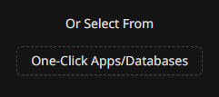

# Install One Click Apps in caprover

I will describe how to install custom `one-click-apps` in `caprover` as It is easy but not straightforward.

1. Go in `apps` and `one click apps/databases`

1. Scroll down till the last item

1. Click It and in the next page paste your captain version 4 yaml.
